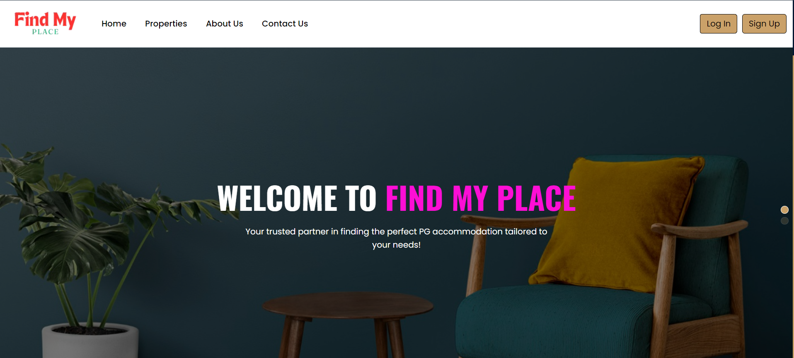
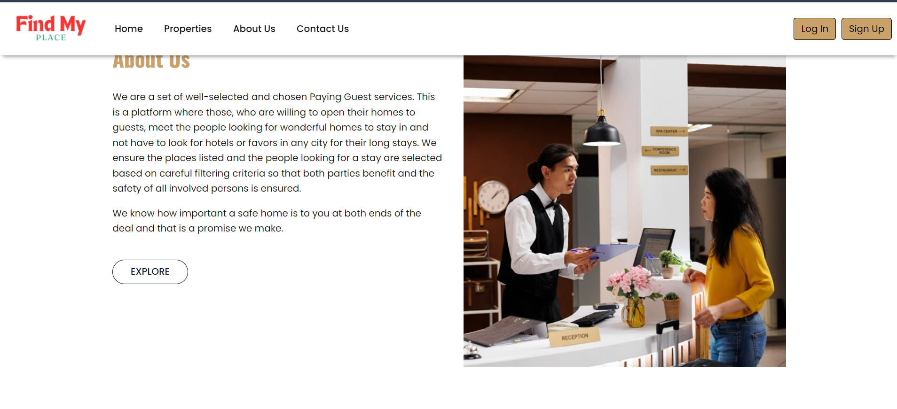
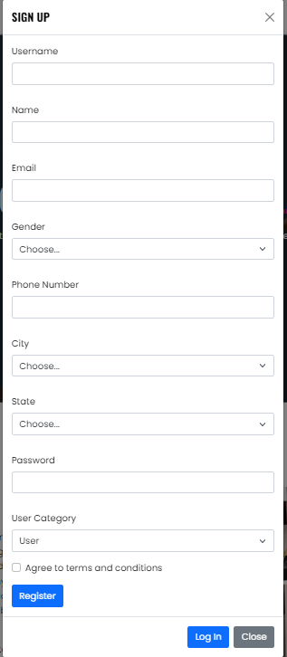

# Find My Place

**Find My Place** is a comprehensive platform designed to help users find the perfect PG (Paying Guest) accommodation. With a user-friendly interface, detailed listings, and advanced search filters, the platform simplifies the process of finding a suitable PG based on location, amenities, and budget. It is ideal for students and working professionals looking for a comfortable and convenient stay.

## Tech Stack

- **Frontend**: HTML, CSS, JavaScript
- **Backend**: Node.js, Express.js
- **Database**: SQL
- **Application**: SQL Workbench

## Features

- Search and filter PG accommodations based on various criteria such as location, price, amenities, and more.
- User registration and authentication for secure access.
- Listings management for PG owners to add, update, or delete their properties.
- Reviews and ratings for properties to help users make informed decisions.

## Getting Started

Follow these instructions to set up and run the project on your local machine.

### Prerequisites

- **Node.js** installed on your machine. You can download it from [Node.js official website](https://nodejs.org/).
- **MySQL Workbench** or any other SQL client to manage the SQL database. You can download it from [MySQL official website](https://dev.mysql.com/downloads/workbench/).

### Installation

1. **Clone the repository:**

   ```bash
   git clone https://github.com/ShivamMaheshwari04/FindMyPlace
   ```


2. **Navigate into the project directory:**

   ```bash
   cd FindMyPlace
   ```

3. **Install project dependencies:**

   ```bash
   npm install
   ```

### Database Setup

1. **Configure the Database Connection:**

   There are two ways to configure the database connection:

   - **Using `.env` File** (Recommended for security):
     
     Create a `.env` file in the root of your project directory and add your MySQL database credentials:

     ```env
     PORT = 3001
     DB_HOST=localhost
     DB_USER=your-username
     DB_PASSWORD=your-password
     DB_NAME=your-database-name
     ```

     Ensure you have the `dotenv` package installed to use environment variables:

     ```bash
     npm install dotenv
     ```

     Then, in your `DBConnect.js` file, use the following code to load these environment variables:

     ```javascript
     require('dotenv').config();
     const mysql = require('mysql');

     const db = mysql.createConnection({
       host: process.env.DB_HOST,
       user: process.env.DB_USER,
       password: process.env.DB_PASSWORD,
       database: process.env.DB_NAME
     });
     ```

   - **Directly in the Code**:

     If you prefer to directly include your credentials in the code (less secure), modify the `DBConnect.js` file as follows:

     ```javascript
     const mysql = require('mysql');

     const db = mysql.createConnection({
       host: 'localhost', // Database host
       user: 'your-username', // Your MySQL username
       password: 'your-password', // Your MySQL password
       database: 'your-database-name' || findmyplace // Your database name
     });
     ```

2. **Create Database Tables:**

   Open MySQL Workbench (or your preferred SQL client) and run the following SQL queries to create the necessary tables:

```sql
-- Give authorization if you create a project for the first time in Workbench
ALTER USER 'root'@'localhost' IDENTIFIED WITH mysql_native_password BY 'Password';

-- First, create the schema
CREATE SCHEMA findmyplace;

-- Create user table
CREATE TABLE findmyplace.user (
  user_id VARCHAR(25) PRIMARY KEY,
  u_name VARCHAR(255) NOT NULL,
  u_email VARCHAR(255) NOT NULL UNIQUE,
  u_city VARCHAR(50) NOT NULL,
  u_state VARCHAR(50) NOT NULL,
  u_phoneNo BIGINT NOT NULL,
  u_gender VARCHAR(15) NOT NULL,
  u_password VARCHAR(255) NOT NULL
);

-- Create owner table
CREATE TABLE findmyplace.Owner (
  owner_id VARCHAR(25) PRIMARY KEY,
  o_name VARCHAR(255) NOT NULL,
  o_email VARCHAR(255) NOT NULL UNIQUE,
  o_city VARCHAR(50) NOT NULL,
  o_state VARCHAR(50) NOT NULL,
  o_contactNo BIGINT NOT NULL,
  o_gender VARCHAR(15) NOT NULL,
  o_password VARCHAR(255) NOT NULL
);

-- Create PG details table
CREATE TABLE findmyplace.pg_details (
  pg_id VARCHAR(25) PRIMARY KEY,
  owner_id VARCHAR(25) NOT NULL,
  pg_name VARCHAR(70) NOT NULL,
  p_city VARCHAR(50) NOT NULL,
  p_address VARCHAR(155) NOT NULL,
  p_state VARCHAR(50) NOT NULL,
  p_contactNo BIGINT NOT NULL,
  pincode BIGINT NOT NULL,
  pg_type VARCHAR(255) NOT NULL,
  FOREIGN KEY (owner_id) REFERENCES findmyplace.Owner(owner_id)
);

-- Create booking table
CREATE TABLE findmyplace.booking (
  b_id VARCHAR(25) PRIMARY KEY,
  r_id VARCHAR(25) NOT NULL,
  u_id VARCHAR(25) NOT NULL,
  u_number BIGINT NOT NULL,
  b_amount DECIMAL(10, 2) NOT NULL,  -- For monetary values
  b_date DATE NOT NULL,
  stayTime VARCHAR(50) NOT NULL,
  b_status ENUM('Pending', 'Confirmed', 'Cancelled') NOT NULL  -- Restricting possible status values
);

-- Create rooms table
CREATE TABLE findmyplace.rooms (
  r_id INT PRIMARY KEY,
  pg_id VARCHAR(25),
  availability INT,
  room_type VARCHAR(50),
  rent DECIMAL(10, 2),
  r_status VARCHAR(20),
  description TEXT
);

-- Run this for updating the status of rooms automatically
DELIMITER $$

CREATE TRIGGER check_room_availability
BEFORE UPDATE ON findmyplace.rooms
FOR EACH ROW
BEGIN
  IF NEW.availability > 0 THEN
    SET NEW.r_status = 'Active';
  ELSEIF NEW.availability = 0 THEN
    SET NEW.r_status = 'Disabled';
  END IF;
END$$

DELIMITER ;
```

### Running the Application

After setting up the database and configuring the connection:

1. **Start the application:**

   ```bash
   npm start
   ```

2. **Access the application:**

   Open your web browser and navigate to `http://localhost:3000` (or the port specified in your configuration).

### Screenshots and Video

Include some screenshots to give a visual overview of your application:

- **Home Page**:  
  

  

- **Sign Up Page**:  
  


### Troubleshooting

- Ensure that your MySQL server is running and that the database credentials in `DBConnect.js` or `.env` file are correct.
- If you encounter any errors related to missing dependencies, try running `npm install` again.

## Contributing

Contributions are welcome! Please fork the repository and submit a pull request for any improvements or bug fixes.

## License

This project is licensed under the MIT License - see the [LICENSE](LICENSE) file for details.

## Contact

For any questions or suggestions, please contact [Shivammaheshwari0401@gmail.com](mailto:Shivammaheshwari0401@gmail.com).
